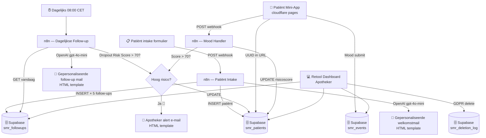

# Stoppen-met-roken Zorgpad Automatisering

> **Demo project** — gebouwd voor APPO sollicitatiegesprek, juni 2026  
> Stack: n8n · Supabase · Retool · HTML/CSS (Cloudflare Pages)

## Het probleem

Alle apotheeksystemen in Nederland werken eenrichting: **apotheek → patiënt**. Niemand heeft de terugrichting gebouwd: **patiënt → apotheek**. Dit systeem voegt die ontbrekende pijl toe — real-time, zonder onderhoud.

## Architectuur



## Dropout Risicoscore

Gebaseerd op Smit et al., 2019 (*Journal of Medical Internet Research*, PMC6753691) — inactiviteit en non-response zijn de sterkste uitvalindicatoren in eHealth lifestyle programma's.

```
Score = (sigaretten/dag × 0.4) + (jaren gerookt × 0.3) + (non-response × 30)

🟢 < 40   → Laag  — normaal zorgpad
🟡 40–70  → Matig — extra aandacht volgende follow-up
🔴 > 70   → Hoog  → directe apotheker notificatie + risicoscore update
```

## Wat de patiënt ziet

De patiënt ontvangt een persoonlijke link in de welkomstmail (UUID in de URL, geen login). De app toont:
- Aantal dagen rookvrij
- Sigaretten niet gerookt
- Geld bespaard
- Stemming-knoppen (Goed / Neutraal / Moeilijk) voor dagelijkse check-ins

Elk antwoord gaat real-time naar Supabase en triggert de n8n Mood Handler voor risicoscoring.

## Wat de apotheker ziet

Retool dashboard met:
- KPI widgets (actieve patiënten, hoog-risico count, gem. score)
- Patiënttabel met kleurgecodeerde risicobadges + filters
- Detail panel per patiënt: follow-up tijdlijn, event log, snelle acties
- GDPR delete met audit trail

## Tech Stack

| Laag | Service | Kosten |
|---|---|---|
| Automatisering | n8n (self-hosted) | €0 |
| Database | Supabase (gratis tier) | €0 |
| Patiënt App | Cloudflare Pages | €0 |
| Dashboard | Retool (gratis tier) | €0 |
| AI | OpenAI gpt-4o-mini | ~€0.01/email |
| Email | Gmail OAuth2 | €0 |

*Totale infrastructuurkosten: €0*

---

*Gebouwd als bewijs van concept voor APPO — apotheekautomatisering met n8n, Supabase en Retool.*
